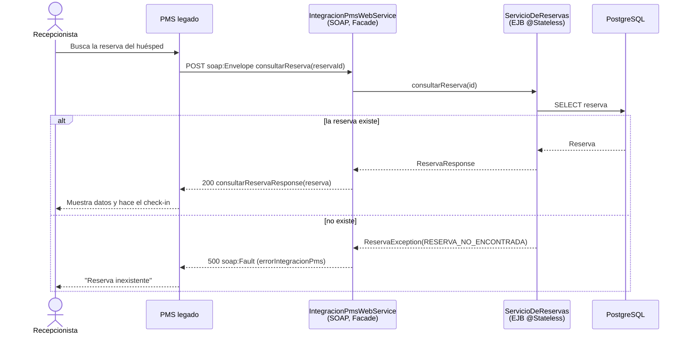
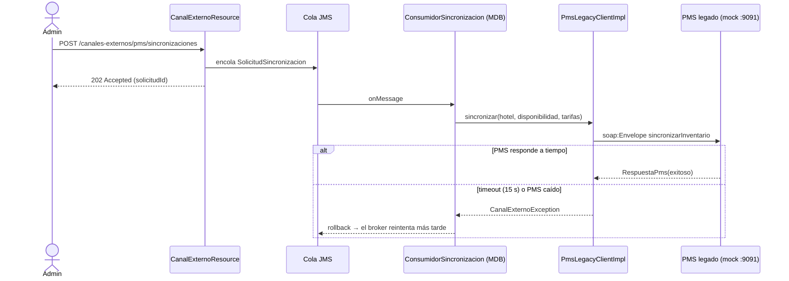

# Integración SOAP con el PMS legado

Documento para la Entrega 4 (09/11): integración síncrona **SOAP con WSDL**, justificada
como conexión con un sistema externo legado.

## 1. El sistema externo

El **PMS (Property Management System)** es el sistema de recepción del hotel: check-in,
check-out, asignación de habitaciones. En StayHub lo modelamos como **legado**: solo expone
y consume servicios **SOAP** descriptos por WSDL. Como el PMS real no existe, lo simulamos
con un servicio JAX-WS standalone (`pms-legado-mock/`).

## 2. Qué se integra y cómo

| # | Flujo | Proveedor SOAP | Consumidor | Sincronía | Justificación |
| --- | --- | --- | --- | --- | --- |
| 1 | Recepción consulta reservas, llegadas del día, disponibilidad y tarifas; cancela un no-show | StayHub (`IntegracionPmsService`) | PMS | **Síncrono** | El recepcionista está atendiendo al huésped y necesita la respuesta en el momento |
| 2 | StayHub envía inventario y tarifas al PMS | PMS (`PmsLegacyService`) | StayHub (Canales Externos) | **Asíncrono (cola JMS) + SOAP** | Nadie espera la respuesta en pantalla y el PMS puede estar lento o caído: la cola desacopla y reintenta |

## 3. Contrato del servicio de StayHub (flujo 1)

- WSDL: `http://localhost:8080/StayHub/soap/integracion-pms?wsdl` (generado por WildFly, code-first)
- SOAP 1.1, document/literal wrapped
- Operaciones: `consultarReserva`, `listarLlegadas`, `cancelarReserva`, `consultarDisponibilidad`, `consultarTarifas`
- Fault: `IntegracionPmsFault` con detalle `errorIntegracionPms { codigo, mensaje }`

Estructura del WSDL, leído de abajo hacia arriba (Clase 9):

- `service IntegracionPmsService` → `port IntegracionPmsPort` → URL del endpoint
- `binding` → SOAP sobre HTTP, `style="document"`, `use="literal"`
- `portType IntegracionPmsPortType` → las 5 operaciones, cada una con input, output y fault
- `message` / `types` → `reserva`, `disponibilidad`, `tarifa`, `errorIntegracionPms` (XSD)

> Guardar el WSDL generado en esta carpeta como `IntegracionPmsService.wsdl`
> (abrir la URL en el navegador y "Guardar como") para adjuntarlo al documento técnico.

## 4. Diagramas de secuencia

### Flujo 1: check-in (PMS → StayHub, síncrono)

### Flujo 2: sincronización de inventario (StayHub → PMS, asíncrono + SOAP)

## 5. ¿Qué pasa si el servicio SOAP no responde? (desafío de la Clase 9)

- **Flujo 2**: el cliente tiene timeout de conexión de 5 s y de lectura de 15 s,
  configurables. Si se vence, el MDB revierte su transacción y el broker reentrega el
  mensaje. El admin ya recibió su `202` y la API nunca queda bloqueada. Para mostrarlo en
  vivo se levanta el mock con `-Dpms.demora.ms=20000`.
- **Flujo 1**: StayHub es el proveedor, así que el timeout lo maneja el PMS. Del lado de
  StayHub, si Inventario no está disponible se responde un Fault
  `DEPENDENCIA_NO_DISPONIBLE` en lugar de colgar la llamada.

## 6. Cómo demostrarlo

1. Levantar WildFly (`standalone-full`) con StayHub desplegado.
2. Abrir `http://localhost:8080/StayHub/soap/integracion-pms?wsdl` y recorrer el WSDL.
3. Correr la colección de Postman `StayHub-IntegracionPmsSOAP`: casos OK y Fault.
4. Levantar el mock: `cd pms-legado-mock && mvn compile exec:java`.
5. `POST /api/canales-externos/pms/sincronizaciones?...` y mostrar en la consola del mock
   lo que recibió el PMS.
6. Repetir con `-Dpms.demora.ms=20000` para mostrar el timeout y el reintento.
