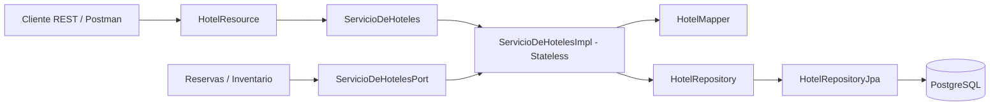

# ServicioDeHoteles - aporte para la Entrega Parcial N.º 1

## 1. Responsabilidad y límites

ServicioDeHoteles administra la información estructural y descriptiva de los establecimientos que
participan en StayHub. Permite crear, modificar, consultar y dar de baja hoteles; gestionar sus tipos
de habitación y habitaciones físicas; registrar capacidad máxima, servicios y características; y
validar que esos elementos existan y pertenezcan entre sí.

El componente no administra disponibilidad por fecha, cupos ni tarifas. Esa responsabilidad pertenece
a ServicioDeInventarioYTarifas. Tampoco crea reservas ni resuelve overbooking. Esta separación evita
responsabilidades solapadas y permite que cada componente evolucione con un motivo de cambio claro.

## 2. Interfaces explícitas

| Interfaz | Consumidor | Operaciones principales | Responsabilidad |
| --- | --- | --- | --- |
| `ServicioDeHoteles` | API REST y administración | Crear, modificar, consultar, listar y dar de baja hoteles, tipos y habitaciones | Facade de casos de uso del componente |
| `ServicioDeHotelesPort` | Reservas, Inventario y otros componentes internos | Consultar hotel, validar hotel/tipo/habitación activa y consultar capacidad | Puerto de lectura sin dependencia HTTP |
| `HotelRepository` | Capa de negocio | Guardar, buscar y listar entidades; verificar duplicados y relaciones | Contrato de acceso a datos |

La interfaz administrativa intercambia DTOs y no expone entidades JPA. El puerto interno ofrece solo
las operaciones que otros componentes necesitan, evitando que dependan de detalles de la API REST o
de la base de datos.

## 3. Tipo de componente: stateless

La implementación se declara con `@Stateless`. Una llamada como `consultarHotel(15)` recibe toda la
información necesaria para ejecutarse y no conserva un estado conversacional para la siguiente
petición. El estado persistente pertenece a PostgreSQL y se accede dentro de las transacciones
administradas por WildFly.

Esta elección permite que el contenedor mantenga un pool de instancias, reutilice cualquiera de ellas
entre usuarios y escale las consultas sin afinidad de sesión. Un EJB stateful no aportaría valor aquí:
no existe un carrito, asistente por pasos ni hold temporal asociado a un cliente. El hold de una
reserva corresponde a ServicioDeInventarioYTarifas.

## 4. Arquitectura en capas

| Capa | Elementos | Decisiones |
| --- | --- | --- |
| Presentación | `HotelResource`, `HotelExceptionMapper`, DTOs | Expone JAX-RS, recibe JSON y traduce errores a HTTP |
| Negocio | `ServicioDeHotelesImpl`, interfaces de servicio, `HotelMapper` | Ejecuta casos de uso, validaciones, bajas lógicas y mapeos |
| Datos | `HotelRepository`, `HotelRepositoryJpa`, entidades | Encapsula JPA y persiste en PostgreSQL mediante `StayHubPU` |

La regla de dependencias es explícita: presentación depende de la interfaz de negocio; negocio depende
del contrato de datos; JPA queda confinado a la implementación del repositorio.

## 5. Patrones aplicados y justificación

### Facade

`ServicioDeHoteles` funciona como Facade porque presenta una entrada única y coherente a un subsistema
formado por hoteles, tipos, habitaciones, validaciones, mapeos y persistencia. Sin esta Facade,
`HotelResource` tendría que conocer repositorios, relaciones JPA y el orden de las operaciones. El
patrón reduce acoplamiento y concentra las transacciones y reglas del componente.

### DAO / Repository

`HotelRepository` abstrae el acceso a datos y `HotelRepositoryJpa` implementa ese contrato mediante
`EntityManager` y JPQL. Las reglas de negocio no conocen consultas ni infraestructura de PostgreSQL.
Esto mejora la mantenibilidad y permite reemplazar el DAO por un doble de prueba sin modificar el
servicio.

### Data Mapper

`HotelMapper` convierte las entidades persistentes en `HotelResponse`, `TipoHabitacionResponse` y
`HabitacionResponse`. La API no serializa entidades JPA directamente, lo que evita filtrar relaciones
lazy, detalles de persistencia o ciclos de referencias. Los DTOs constituyen un contrato estable para
clientes y otros componentes.

Estos patrones resuelven problemas presentes en el componente. No se agregó Factory o Strategy solo
para aumentar el conteo: hoy no hay una familia de objetos compleja ni algoritmos alternativos que lo
justifiquen. El tercer patrón obligatorio se evalúa a nivel del sistema y también puede respaldarse con
Adapter en ServicioDeCanalesExternos.

## 6. Stack tecnológico

- Java 17 y Jakarta EE 10.
- EJB `@Stateless` para la capa de negocio y transacciones administradas por el contenedor.
- JAX-RS para la API REST.
- CDI para inyección de dependencias.
- JPA/Hibernate con la unidad `StayHubPU`.
- PostgreSQL mediante el datasource WildFly `java:/PostgresDS`.
- Maven para compilación y empaquetado WAR.
- WildFly como servidor de aplicaciones.

La elección es consistente con una aplicación empresarial basada en componentes: el contenedor
administra ciclo de vida, inyección, transacciones, REST y persistencia, mientras que PostgreSQL
mantiene el estado duradero.

## 7. Evidencia para el checkpoint del 31/08

La implementación ya incluye las tres capas, la Facade explícita, el puerto interno, el DAO JPA, las
entidades y los endpoints REST. El proyecto genera `target/StayHub.war` y la colección
`postman/StayHub-ServicioDeHoteles.postman_collection.json` automatiza el flujo de alta, modificación,
consulta, validaciones y bajas lógicas.

Para cerrar la evidencia de la entrega falta ejecutar el WAR en un WildFly real con `PostgresDS`,
correr la colección de Postman y conservar capturas del despliegue exitoso y de las pruebas. La
consigna del 31/08 exige al menos un componente desplegado en un contenedor real; compilar el WAR sin
desplegarlo no alcanza para afirmar que ese punto está cumplido.

## 8. Relación con el cronograma

En la Entrega Parcial N.º 1 del 31/08 los patrones todavía no figuran como requisito independiente:
se exige arquitectura general, interfaces documentadas, capas, stack, un componente real desplegado y
la justificación stateful/stateless. Documentarlos ahora deja preparado ServicioDeHoteles para la
Entrega Obligatoria N.º 1 del 14/09, donde sí se requieren al menos tres patrones distintos aplicados y
justificados a nivel del sistema.
