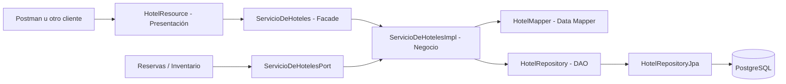

# ServicioDeHoteles

Componente Jakarta EE `@Stateless` que administra el catálogo estructural y descriptivo de StayHub.
La API usa JAX-RS, la persistencia usa JPA y las operaciones se ejecutan dentro de las transacciones
administradas por WildFly. Para la entrega del 14/09 aporta uno de los componentes completos, el
componente stateless, la separación en tres capas y tres patrones de diseño justificados.

## Alcance

- Alta, modificación, consulta y baja lógica de hoteles.
- Gestión y consulta de tipos de habitación.
- Gestión y consulta de habitaciones físicas.
- Capacidad máxima, servicios y características descriptivas.
- Validación de pertenencia entre hotel, tipo y habitación.
- Contrato interno `ServicioDeHotelesPort` para que otros componentes validen la existencia y
  capacidad de hoteles, tipos y habitaciones sin depender de HTTP.

La baja es lógica para conservar referencias históricas. Al dar de baja un hotel también se
desactivan sus tipos y habitaciones. Un tipo no puede darse de baja si todavía posee habitaciones
activas.

La política de ciclo de vida es **histórico inmutable**: un hotel, tipo o habitación dado de baja
puede consultarse, pero no modificarse ni reactivarse. Sus códigos y números tampoco se reutilizan,
para que las referencias históricas nunca cambien de significado.

Este componente no calcula disponibilidad por fecha, cupos, tarifas, reservas ni overbooking. Esas
responsabilidades pertenecen a los demás componentes de StayHub.

## Arquitectura en capas

| Capa | Paquetes y clases principales | Responsabilidad |
| --- | --- | --- |
| Presentación | `api/HotelResource`, `HotelExceptionMapper`, `JsonProcessingExceptionMapper`, DTOs | Adaptar HTTP/JSON y códigos de estado |
| Negocio | `service/ServicioDeHotelesImpl`, `ServicioDeHoteles`, `contrato/ServicioDeHotelesPort` | Casos de uso, reglas y validaciones |
| Datos | `repository/HotelRepository`, `HotelRepositoryJpa`, `model/*` | Persistencia JPA y modelo del dominio |



Las dependencias avanzan hacia contratos: la presentación conoce la Facade, el negocio conoce el
DAO y solamente la implementación JPA conoce `EntityManager` y PostgreSQL.

## Patrones aplicados

### Facade

`ServicioDeHoteles` ofrece una entrada única y de alto nivel para administrar hoteles, tipos y
habitaciones. `HotelResource` delega en esa interfaz y no coordina repositorios ni entidades. La
implementación también ofrece `ServicioDeHotelesPort`, una vista de lectura acotada para otros
componentes.

### DAO / Repository

`HotelRepository` define las operaciones de persistencia que necesita el negocio y
`HotelRepositoryJpa` las resuelve con JPA. Esto evita acoplar las reglas de negocio a Hibernate,
PostgreSQL o consultas JPQL concretas y permite sustituir la implementación en pruebas.

### Data Mapper

`HotelMapper` transforma `Hotel`, `TipoHabitacion` y `Habitacion` en DTOs de respuesta. Así las
entidades JPA, sus relaciones lazy y sus detalles internos no se filtran hacia REST ni hacia otros
componentes.

No se incorporó Factory o Strategy de manera artificial: actualmente no existen familias de objetos
ni algoritmos intercambiables que justifiquen esos patrones. Facade, DAO o Repository y Data Mapper
permiten que este componente aporte por sí mismo tres patrones distintos al requisito global.

## Aporte a la entrega del 14/09

| Requisito | Evidencia de este componente |
| --- | --- |
| Componente completo y en capas | API REST, negocio EJB y repositorio JPA separados por interfaces |
| Componente stateless | `ServicioDeHotelesImpl` está anotado con `@Stateless` y no guarda estado conversacional |
| Patrones | Facade, DAO o Repository y Data Mapper implementados en clases concretas |
| Interfaz explícita | `ServicioDeHoteles` para administración y `ServicioDeHotelesPort` para consumo interno |
| Evidencia funcional | WAR compilable, pruebas JUnit y colección de Postman |

El componente stateful y la seguridad declarativa se resuelven a nivel global en Reservas; no se
atribuyen a ServicioDeHoteles. Esta documentación debe incorporarse al documento técnico consolidado
de 5 a 8 páginas y no reemplaza la evidencia de los demás componentes.

## API REST

Con el WAR `StayHub.war`, la URL base predeterminada es:

```text
http://localhost:8080/StayHub/api/hoteles
```

| Método | Ruta | Resultado |
| --- | --- | --- |
| `POST` | `/hoteles` | Crea un hotel (`201`) |
| `GET` | `/hoteles?incluirInactivos=false` | Lista hoteles |
| `GET` | `/hoteles/{hotelId}` | Consulta el detalle completo |
| `PUT` | `/hoteles/{hotelId}` | Modifica datos, servicios y descripción |
| `DELETE` | `/hoteles/{hotelId}` | Realiza la baja lógica |
| `POST` | `/hoteles/{hotelId}/tipos-habitacion` | Crea un tipo (`201`) |
| `GET` | `/hoteles/{hotelId}/tipos-habitacion?incluirInactivos=false` | Lista tipos |
| `GET` | `/hoteles/{hotelId}/tipos-habitacion/{tipoId}` | Consulta un tipo |
| `PUT` | `/hoteles/{hotelId}/tipos-habitacion/{tipoId}` | Modifica un tipo |
| `DELETE` | `/hoteles/{hotelId}/tipos-habitacion/{tipoId}` | Da de baja un tipo (`204`) |
| `POST` | `/hoteles/{hotelId}/habitaciones` | Crea una habitación (`201`) |
| `GET` | `/hoteles/{hotelId}/habitaciones?incluirInactivas=false` | Lista habitaciones |
| `GET` | `/hoteles/{hotelId}/habitaciones/{habitacionId}` | Consulta una habitación |
| `PUT` | `/hoteles/{hotelId}/habitaciones/{habitacionId}` | Modifica una habitación |
| `DELETE` | `/hoteles/{hotelId}/habitaciones/{habitacionId}` | Da de baja una habitación (`204`) |

Los listados omiten elementos inactivos por defecto. Las consultas directas permiten verlos para
auditoría. Los errores de validación se devuelven como JSON con `codigo`, `mensaje` y `fecha`. Esto
incluye JSON malformado, tipos JSON incorrectos, IDs textuales y capacidades con parte decimal.

Los códigos de tipo y los números de habitación se persisten en mayúsculas. Las restricciones
únicas de PostgreSQL son la garantía final frente a altas simultáneas; si dos solicitudes compiten
por el mismo valor, una obtiene `201` y la otra `409`, sin exponer SQL ni nombres de restricciones.

## PostgreSQL y WildFly

El proyecto comparte una única unidad de persistencia con el resto de los componentes:

- Unidad JPA: `StayHubPU`.
- Datasource JNDI esperado en WildFly: `java:/PostgresDS`.
- Motor: PostgreSQL.
- Esquema: Hibernate lo actualiza con `hibernate.hbm2ddl.auto=update`.

Antes de desplegar, el driver JDBC de PostgreSQL debe estar instalado en WildFly y el datasource
`PostgresDS` debe apuntar a una base existente con credenciales válidas. No hace falta crear las tablas
del servicio manualmente.

Desde la carpeta `proyecto`:

```bash
mvn clean package
```

El artefacto queda en `target/StayHub.war`. Puede copiarse a
`WILDFLY_HOME/standalone/deployments/` o desplegarse desde la consola de administración. Una vez que
WildFly informe que el despliegue terminó correctamente, esta llamada debe responder `200`:

```text
GET http://localhost:8080/StayHub/api/hoteles
```

## Postman

Importar `postman/StayHub-ServicioDeHoteles.postman_collection.json` y ejecutar la carpeta en orden.
La colección crea sus propios datos, guarda automáticamente `hotelId`, `tipoId` y `habitacionId`,
verifica las respuestas y termina probando las bajas lógicas. Si WildFly usa otro host, puerto o
context root, solo hay que modificar la variable `baseUrl` de la colección.

La colección también ejecuta pruebas adversariales de JSON, capacidades decimales, modificaciones
posteriores a una baja y dos carreras concurrentes reales mediante `pm.sendRequest`.

## Pruebas automáticas

Las pruebas unitarias del componente se ejecutan junto con el build:

```bash
mvn test
```

Actualmente son 11 pruebas. Cubren la normalización de números, la traducción de violaciones únicas
de PostgreSQL, la política de bajas, las capacidades enteras, los IDs inválidos y la detección de
errores JSON de RESTEasy.
