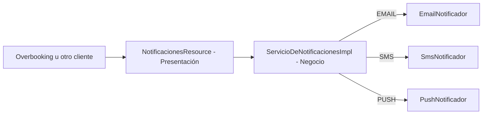

# ServicioDeNotificaciones

Componente Jakarta EE `@Stateless` que envía notificaciones a los huéspedes por el canal que se le
pida (email, SMS o push). No tiene persistencia propia: es un componente de paso, sin estado y sin
tabla en base de datos, que recibe una solicitud y la despacha al canal correspondiente.

## Alcance

- Enviar una notificación a un destinatario, eligiendo el canal (`EMAIL`, `SMS` o `PUSH`) indicado
  en la solicitud.
- Tipificar el evento que origina la notificación (`CONFIRMACION_RESERVA`, `CANCELACION`,
  `RECORDATORIO`, `RESULTADO_OVERBOOKING`, `AVISO_PAGO`), aunque hoy ese dato no cambia el
  comportamiento del envío, solo viaja como metadato.
- Devolver si el envío fue exitoso o no.

**Nota honesta:** las tres implementaciones de canal (`EmailNotificador`, `SmsNotificador`,
`PushNotificador`) son *stubs* marcados con `TODO`: hoy solo imprimen el mensaje por consola, no
integran ningún proveedor real (SMTP, un gateway de SMS, FCM/APNs). El contrato y la selección de
canal ya están resueltos; falta conectar cada canal a un proveedor real.

Actualmente el único consumidor confirmado de este servicio dentro del código es
`ServicioDeOverbooking`, que lo invoca de forma "best-effort" (si Notificaciones no está desplegado,
Overbooking sigue funcionando igual).

## Arquitectura en capas

| Capa | Paquetes y clases principales | Responsabilidad |
| --- | --- | --- |
| Presentación | `api/NotificacionesResource`, `NotificacionExceptionMapper` | Adaptar HTTP/JSON y códigos de estado |
| Negocio | `service/ServicioDeNotificacionesImpl`, `contrato/ServicioDeNotificaciones` | Validación y selección del canal |
| Integración | `client/NotificadorCanal`, `EmailNotificador`, `SmsNotificador`, `PushNotificador` | Envío concreto por cada canal |

No hay capa de datos: este componente no persiste nada (no tiene `repository/` ni entidades JPA).



## Patrones aplicados

### Strategy

`NotificadorCanal` define el contrato común para enviar una notificación, y `EmailNotificador`,
`SmsNotificador` y `PushNotificador` son tres estrategias intercambiables que implementan ese
contrato cada una a su manera. `ServicioDeNotificacionesImpl` elige cuál usar en tiempo de
ejecución según el `canalPreferido` de la solicitud, sin necesitar un `if/else` por cada canal
dentro de la lógica de envío.

## API REST

Con el WAR `StayHub.war`, la URL base predeterminada es:

```text
http://localhost:8080/StayHub/api/notificaciones
```

| Método | Ruta | Resultado |
| --- | --- | --- |
| `POST` | `/notificaciones/enviar` | Envía una notificación por el canal indicado |

## Estado actual: síncrono, no asíncrono

A diferencia de lo que a veces se documenta en diagramas generales del proyecto, este componente
**no** usa colas ni un Message-Driven Bean: `NotificacionesResource` responde el request HTTP
directamente, de forma síncrona. El único MDB de todo el proyecto es `ConsumidorSincronizacion`, en
Canales Externos. Migrar Notificaciones a un modelo asincrónico (consumir eventos vía JMS en vez de
que lo llamen por REST) es un candidato natural para una próxima entrega, pero hoy no está
implementado así.
