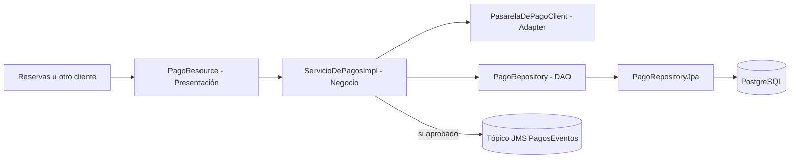

# ServicioDePagos

Componente Jakarta EE `@Stateless` que procesa el cobro asociado a una reserva. Delega el cobro
efectivo a una pasarela externa a través de un `PasarelaDePagoClient` (actualmente una
implementación mock, `PasarelaDePagoClientMock`, pensada para reemplazarse por una integración real
sin tocar el resto del componente) y, cuando el pago se aprueba, publica un evento de dominio.

## Alcance

- Procesar el pago de una reserva (`monto`, `moneda`, `reservaId`).
- Consultar un pago ya procesado por su id.
- Registrar el resultado del cobro con estado `PENDIENTE` → `APROBADO` / `RECHAZADO`.
- Publicar un evento `EventoPagoAprobado` en un tópico JMS cuando el pago es aprobado, para que
  otros componentes puedan reaccionar (por ejemplo, Reservas o Notificaciones).

Este componente no calcula el monto a cobrar ni valida disponibilidad: recibe el monto ya
determinado por quien lo invoca (típicamente `ServicioDeReservas`) y se limita a cobrarlo y
registrar el resultado.

## Arquitectura en capas

| Capa | Paquetes y clases principales | Responsabilidad |
| --- | --- | --- |
| Presentación | `api/PagoResource`, `PagoExceptionMapper` | Adaptar HTTP/JSON y códigos de estado |
| Negocio | `service/ServicioDePagosImpl`, `contrato/ServicioDePagos`, `client/pasarela/PasarelaDePagoClient` | Caso de uso de cobro, validación y orquestación |
| Datos | `repository/PagoRepository`, `PagoRepositoryJpa`, `model/Pago`, `model/EstadoPago` | Persistencia JPA y modelo del dominio |



## Patrones aplicados

### DAO / Repository

`PagoRepository` define las operaciones de persistencia que necesita el negocio, resueltas por
`PagoRepositoryJpa`. Igual que en el resto de los componentes, esto separa las reglas de negocio de
JPA y PostgreSQL.

### Adapter

`PasarelaDePagoClient` es la interfaz que el servicio usa para cobrar, sin conocer los detalles de
la pasarela real. `PasarelaDePagoClientMock` es la implementación actual, pensada para poder
reemplazarse por un cliente contra una pasarela de pago real sin modificar `ServicioDePagosImpl`.

### Publish-Subscribe (evento de dominio)

`PublicadorEventoPago` publica `EventoPagoAprobado` en el tópico JMS `PagosEventos`
(`java:/jms/topic/PagosEventos`) cada vez que un pago se aprueba. **Nota honesta:** en el código
actual no existe ningún `@MessageDriven` que consuma ese tópico — el único MDB del proyecto es
`ConsumidorSincronizacion`, en Canales Externos, y consume otra cola distinta. La publicación está
implementada y probada, pero todavía no tiene un suscriptor real; es la base para conectar, por
ejemplo, Notificaciones de forma asincrónica en una próxima entrega.

## API REST

Con el WAR `StayHub.war`, la URL base predeterminada es:

```text
http://localhost:8080/StayHub/api/pagos
```

| Método | Ruta | Resultado |
| --- | --- | --- |
| `POST` | `/pagos` | Procesa un pago (`201` si se aprueba, error de negocio si se rechaza) |
| `GET` | `/pagos/{id}` | Consulta un pago ya procesado |

## PostgreSQL y WildFly

Comparte la unidad de persistencia `StayHubPU` y el datasource `java:/PostgresDS` con el resto de
los componentes. Como publica en un tópico JMS, este componente necesita desplegarse con
`standalone-full.xml` (el perfil que habilita JMS), igual que Canales Externos.

## Postman

Importar `postman/Stayhub pagos.postman collection.json` para probar el flujo de cobro contra un
servidor desplegado.
