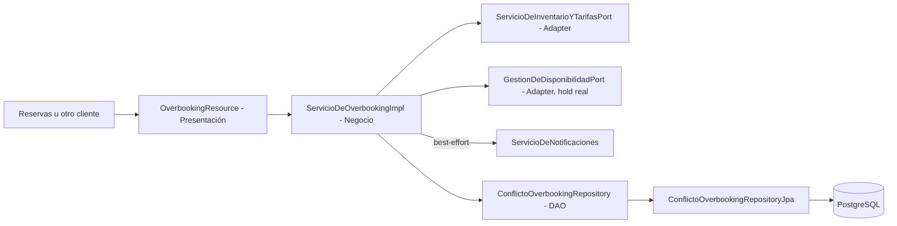

# ServicioDeOverbooking

Componente Jakarta EE `@Stateless` que resuelve conflictos cuando una reserva confirmada no se
puede cumplir (overbooking real: se vendió más de lo que hay disponible). Busca una alternativa en
el mismo hotel y período, intenta retenerla con un hold real antes de darla por resuelta, y si no
hay alternativa disponible, resuelve por compensación.

## Alcance

- Resolver un conflicto de overbooking recibido para una reserva, un hotel y un período.
- Buscar un tipo de habitación alternativo con cupo suficiente en el mismo hotel y fechas.
- Retener esa alternativa con un hold real (reutilizando el mismo mecanismo de
  `ServicioDeInventarioYTarifas` que usa `ServicioDeReservas`) antes de confirmar la reubicación,
  para no "prometer" una habitación que otra solicitud podría tomar mientras tanto.
- Si no hay alternativa, o si el hold falla porque otra solicitud se adelantó, resolver por
  compensación en vez de reubicación.
- Registrar el conflicto y su resolución, y notificar al huésped afectado (si hay email y el
  componente de Notificaciones está disponible).

**Nota honesta:** el enum `EstrategiaResolucion` define una tercera estrategia,
`CANCELACION_ANTICIPADA`, que hoy no está implementada en `resolverConflicto` — la lógica actual
solo aplica `REUBICACION` o `COMPENSACION`. Queda declarada para una posible extensión futura.

## Arquitectura en capas

| Capa | Paquetes y clases principales | Responsabilidad |
| --- | --- | --- |
| Presentación | `api/OverbookingResource`, `OverbookingExceptionMapper` | Adaptar HTTP/JSON y códigos de estado |
| Negocio | `service/ServicioDeOverbookingImpl`, `contrato/ServicioDeOverbooking`, `contrato/interno/ServicioDeInventarioYTarifasPort` | Resolución del conflicto y orquestación entre componentes |
| Datos | `repository/ConflictoOverbookingRepository`, `ConflictoOverbookingRepositoryJpa`, `model/ConflictoOverbooking`, `EstrategiaResolucion` | Persistencia JPA y modelo del dominio |



## Patrones aplicados

### DAO / Repository

`ConflictoOverbookingRepository` separa la persistencia del conflicto de la lógica que decide cómo
resolverlo, resuelto con JPA por `ConflictoOverbookingRepositoryJpa`.

### Adapter

`ServicioDeInventarioYTarifasPort` y `GestionDeDisponibilidadPort` (este último, el mismo puerto que
usa `ServicioDeReservas`) desacoplan a Overbooking de la implementación concreta de Inventario y
Tarifas. El componente depende de una interfaz propia, no de la clase de otro equipo.

### Dependencia opcional con degradación controlada

Igual que en otros componentes del sistema, las dependencias externas (`ServicioDeInventarioYTarifasPort`,
`GestionDeDisponibilidadPort`, `ServicioDeNotificaciones`) se inyectan como `Instance<T>` y se
comprueba `isResolvable()` antes de usarlas. Si Inventario y Tarifas no está desplegado, Overbooking
responde con un error de negocio claro (`DEPENDENCIA_NO_DISPONIBLE`) en vez de romperse; si
Notificaciones no está disponible, simplemente no notifica y sigue funcionando (best-effort).

## API REST

Con el WAR `StayHub.war`, la URL base predeterminada es:

```text
http://localhost:8080/StayHub/api/overbooking
```

| Método | Ruta | Resultado |
| --- | --- | --- |
| `POST` | `/overbooking/resolver` | Resuelve un conflicto de overbooking (reubicación o compensación) |

## PostgreSQL

Comparte la unidad de persistencia `StayHubPU` y el datasource `java:/PostgresDS` con el resto de
los componentes.
