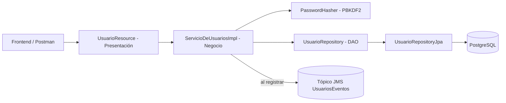

# ServicioDeUsuarios

Componente Jakarta EE `@Stateless` que gestiona el registro, la autenticación y la consulta de
usuarios de StayHub (huéspedes y administradores). Las contraseñas nunca se guardan en texto plano:
se hashean con PBKDF2 antes de persistirse.

## Alcance

- Registrar un usuario nuevo, con validación de datos obligatorios y de que el email no esté ya
  registrado.
- Autenticar un usuario por email y contraseña (`login`).
- Consultar un usuario por id.
- Publicar un evento `EventoUsuarioRegistrado` en un tópico JMS al completarse un registro.

Este componente no administra los roles de acceso de WildFly (`ApplicationRealm`) usados por
`@RolesAllowed` en el resto del sistema — eso es configuración del servidor. Lo que sí administra es
el rol de negocio (`HUESPED` / `ADMIN`) asociado a cada usuario en el dominio.

## Arquitectura en capas

| Capa | Paquetes y clases principales | Responsabilidad |
| --- | --- | --- |
| Presentación | `api/UsuarioResource`, `UsuarioExceptionMapper` | Adaptar HTTP/JSON y códigos de estado |
| Negocio | `service/ServicioDeUsuariosImpl`, `contrato/ServicioDeUsuarios`, `service/PasswordHasher` | Registro, autenticación y hashing seguro |
| Datos | `repository/UsuarioRepository`, `UsuarioRepositoryJpa`, `model/Usuario`, `model/RolUsuario` | Persistencia JPA y modelo del dominio |



## Patrones aplicados

### DAO / Repository

`UsuarioRepository` separa la persistencia del usuario de las reglas de negocio (validación,
unicidad de email, hashing), resuelto con JPA por `UsuarioRepositoryJpa`.

### Data Mapper

`UsuarioMapper` transforma la entidad `Usuario` en `UsuarioResponse`, evitando exponer el
`passwordHash` u otros detalles internos de la entidad hacia REST.

### Publish-Subscribe (evento de dominio)

`PublicadorEventoUsuario` publica `EventoUsuarioRegistrado` en el tópico JMS `UsuariosEventos`
(`java:/jms/topic/UsuariosEventos`) al registrarse un usuario nuevo — mismo criterio que
`PublicadorEventoPago` en Pagos. **Nota honesta:** al igual que en Pagos, hoy no existe ningún
`@MessageDriven` que consuma este tópico; la publicación está lista pero todavía sin suscriptor.

## API REST

Con el WAR `StayHub.war`, la URL base predeterminada es:

```text
http://localhost:8080/StayHub/api/usuarios
```

| Método | Ruta | Resultado |
| --- | --- | --- |
| `POST` | `/usuarios` | Registra un usuario nuevo (`201`) |
| `POST` | `/usuarios/login` | Autentica por email y contraseña |
| `GET` | `/usuarios/{id}` | Consulta un usuario por id |

## PostgreSQL y WildFly

Comparte la unidad de persistencia `StayHubPU` y el datasource `java:/PostgresDS` con el resto de
los componentes. Como publica en un tópico JMS, necesita desplegarse con `standalone-full.xml`.

## Postman

Importar `postman/Stayhub usuarios.postman.collection.json` para probar registro, login y consulta
contra un servidor desplegado.
